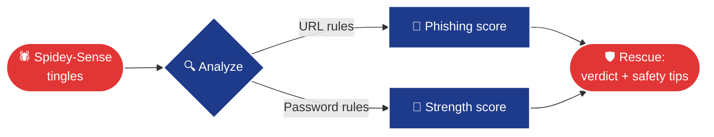

<!-- HEADER BANNER -->


<div align="center">

<!-- TYPING ANIMATION -->
<a href="#">
  
</a>

<br/>


<br/>

> ### *"With great power comes great responsibility... and safe passwords."*

</div>

---

## 🕸️ Mission Briefing

Spidey-Sense is a friendly neighborhood guardian that **protects everyday people in the digital world**.
When danger is near, it tingles, analyzes the threat and tells you exactly how to stay safe.

<table>
<tr>
<td width="50%" align="center">

### 🎣 Phishing Radar
Scans links for fake-login tricks, raw IPs, hidden `@` redirects, bait words and shady domains.

</td>
<td width="50%" align="center">

### 🔑 Password Shield
Checks strength, length, variety and common-password lists, then gives clear tips.

</td>
</tr>
<tr>
<td align="center">

### ⚡ Instant Results
Simple command line. Type a command, get a verdict in under a second.

</td>
<td align="center">

### 🧠 Explainable
Every warning comes with the *reason*, so people learn to spot scams themselves.

</td>
</tr>
</table>

**Subject domain:** Cybersecurity awareness and online safety.

---

## 🕷️ How the Web Works



### 🚦 Threat Levels

| Level | Meaning | What to do |
|:-----:|---------|------------|
| 🟢 **SAFE** | No warning signs found | Proceed normally |
| 🟠 **SUSPICIOUS** | A few red flags | Double-check the sender and site |
| 🔴 **DANGER** | Strong phishing signs | Do **not** click or enter any details |

---

## 📺 Live Demo (sample output)

```text
$ python -m spidey_sense url "http://192.168.1.5/secure-login/verify@bank.xyz"

🔴 DANGER (threat score 10)
  • Not using HTTPS
  • Uses a raw IP address instead of a domain
  • Contains '@' (can hide the real destination)
  • Bait words: login, verify, secure, bank
```

```text
$ python -m spidey_sense url "http://mysite.com/login"

🟠 SUSPICIOUS (threat score 3)
  • Not using HTTPS
  • Bait words: login
```

```text
$ python -m spidey_sense url "https://github.com"

🟢 SAFE (threat score 0)
```

```text
$ python -m spidey_sense password "password"

🔴 WEAK (0/5)
  • This is a very common password
```

```text
$ python -m spidey_sense password "Web!Sling3r#Night42"

🟢 STRONG (4/5)
```

---

## 🚀 Quick Start

```bash
# 1. Get the code
git clone https://github.com/<your-username>/<your-repo>.git
cd <your-repo>

# 2. Scan a link
python -m spidey_sense url "http://example.com/login"

# 3. Check a password
python -m spidey_sense password "MyP@ssw0rd"
```

> 💡 **No computer?** Open the repo, click **Code → Codespaces → Create codespace** and run the commands online for free.

### 📁 Project Structure

```text
spidey-sense/
├── 🕸️ spidey_sense/
│   ├── __init__.py      # package entry
│   ├── __main__.py      # python -m spidey_sense
│   ├── phishing.py      # 🎣 link analyzer
│   ├── passwords.py     # 🔑 password checker
│   └── cli.py           # ⌨️ command line
└── 📄 README.md
```

---

## 🐍 Source Code

<details>
<summary>🕸️ <b>spidey_sense/__init__.py</b></summary>

```python
"""Spidey-Sense: a friendly neighborhood guardian for the digital world."""
from .phishing import check_url
from .passwords import check_password

__all__ = ["check_url", "check_password"]
__version__ = "0.1.0"
```
</details>

<details>
<summary>🕸️ <b>spidey_sense/__main__.py</b></summary>

```python
from .cli import main
main()
```
</details>

<details>
<summary>🎣 <b>spidey_sense/phishing.py</b></summary>

```python
"""Heuristic phishing-link detection (educational, not a replacement for real security tools)."""
import re
from urllib.parse import urlparse

SUSPICIOUS_TLDS = {"zip", "xyz", "top", "click", "tk", "gq", "ml", "cf"}
BAIT_WORDS = ("login", "verify", "secure", "account", "update", "bank", "wallet", "password")
IP_RE = re.compile(r"^\d{1,3}(\.\d{1,3}){3}$")


def check_url(url: str) -> dict:
    """Return a threat report: {'url', 'score', 'level', 'reasons'}."""
    if "://" not in url:
        url = "http://" + url
    parsed = urlparse(url)
    host = (parsed.hostname or "").lower()
    score, reasons = 0, []

    if parsed.scheme != "https":
        score += 2; reasons.append("Not using HTTPS")
    if IP_RE.match(host):
        score += 3; reasons.append("Uses a raw IP address instead of a domain")
    if "@" in url:
        score += 3; reasons.append("Contains '@' (can hide the real destination)")
    if "xn--" in host:
        score += 2; reasons.append("Punycode domain (possible look-alike characters)")
    if host.count(".") >= 4:
        score += 1; reasons.append("Too many subdomains")
    if host.rsplit(".", 1)[-1] in SUSPICIOUS_TLDS:
        score += 2; reasons.append("Suspicious top-level domain")
    if host.count("-") >= 3:
        score += 1; reasons.append("Many hyphens in the domain")
    bait = [w for w in BAIT_WORDS if w in url.lower()]
    if bait:
        score += min(len(bait), 2); reasons.append("Bait words: " + ", ".join(bait))
    if len(url) > 75:
        score += 1; reasons.append("Unusually long URL")

    level = "SAFE" if score <= 1 else "SUSPICIOUS" if score <= 3 else "DANGER"
    return {"url": url, "score": score, "level": level, "reasons": reasons}
```
</details>

<details>
<summary>🔑 <b>spidey_sense/passwords.py</b></summary>

```python
"""Password strength checker."""
import re

COMMON = {"password", "123456", "12345678", "qwerty", "abc123", "letmein",
          "iloveyou", "admin", "welcome", "spiderman", "monkey", "dragon"}


def check_password(pw: str) -> dict:
    """Return {'score': 0-5, 'level', 'tips'}."""
    score, tips = 0, []
    if pw.lower() in COMMON:
        return {"score": 0, "level": "WEAK", "tips": ["This is a very common password"]}

    if len(pw) >= 12: score += 2
    elif len(pw) >= 8: score += 1
    else: tips.append("Use at least 12 characters")

    kinds = [r"[a-z]", r"[A-Z]", r"\d", r"[^\w\s]"]
    variety = sum(bool(re.search(k, pw)) for k in kinds)
    score += 1 if variety >= 3 else 0
    score += 1 if variety == 4 else 0
    if variety < 4:
        tips.append("Mix upper/lower case, numbers and symbols")

    if re.search(r"(.)\1{2,}", pw):
        score = max(score - 1, 0); tips.append("Avoid repeated characters")

    level = "WEAK" if score <= 1 else "OKAY" if score <= 3 else "STRONG"
    return {"score": score, "level": level, "tips": tips}
```
</details>

<details>
<summary>⌨️ <b>spidey_sense/cli.py</b></summary>

```python
"""Command line: `python -m spidey_sense url <link>` or `password`."""
import argparse
import getpass

from .passwords import check_password
from .phishing import check_url

ICON = {"SAFE": "🟢", "OKAY": "🟡", "SUSPICIOUS": "🟠", "DANGER": "🔴", "WEAK": "🔴", "STRONG": "🟢"}


def main(argv=None):
    p = argparse.ArgumentParser(prog="spidey-sense", description="Your friendly neighborhood guardian")
    sub = p.add_subparsers(dest="cmd", required=True)
    u = sub.add_parser("url", help="scan a link for phishing signs"); u.add_argument("link")
    w = sub.add_parser("password", help="check password strength"); w.add_argument("pw", nargs="?")
    args = p.parse_args(argv)

    if args.cmd == "url":
        r = check_url(args.link)
        print(f"{ICON[r['level']]} {r['level']} (threat score {r['score']})")
        for reason in r["reasons"]:
            print("  •", reason)
    else:
        r = check_password(args.pw or getpass.getpass("Password: "))
        print(f"{ICON[r['level']]} {r['level']} ({r['score']}/5)")
        for tip in r["tips"]:
            print("  •", tip)


if __name__ == "__main__":
    main()
```
</details>

---

## 🗺️ Roadmap

- [x] Phishing link scanner
- [x] Password strength checker
- [ ] Check passwords against breach lists (safely)
- [ ] Browser extension for live link scanning
- [ ] Email header analyzer
- [ ] Web dashboard

## ⚠️ Disclaimer

Heuristic, educational project, not a substitute for professional security tools.
Unofficial fan-inspired project, not affiliated with Marvel or Disney. All artwork here is original.

## 📄 License

Released under the **MIT License**.

<div align="center">

### 🕷️ *Stay safe out there, web-slinger.*

</div>

<!-- FOOTER BANNER -->

